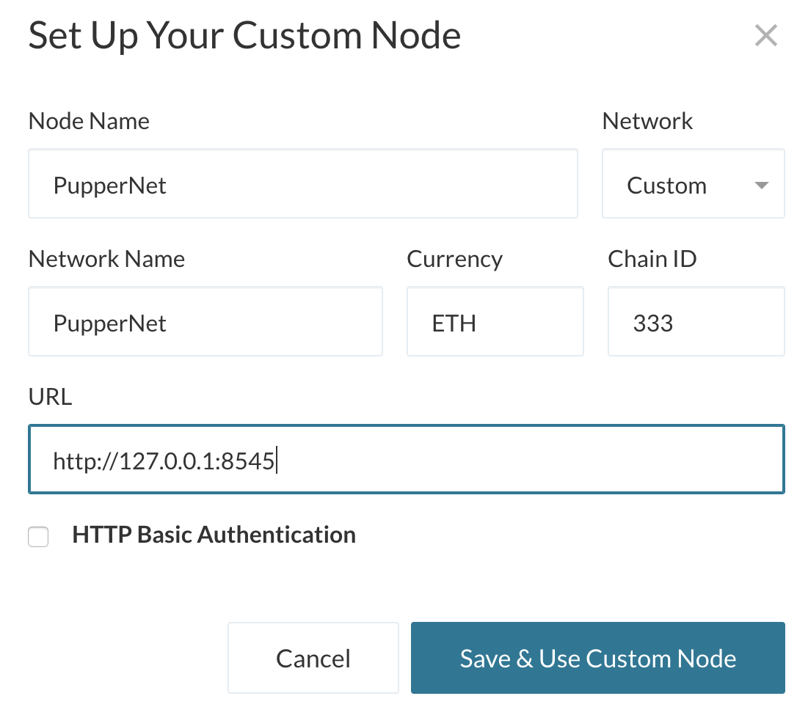

Public address of the key:   0x5F6d6b4890bA78d2b85f258826B979E816729c34              Path of the secret key file: ..\SeanzieNet\node1\keystore\UTC--2021-09-06T15-42-51.914750100Z--5f6d6b4890ba78d2b85f258826b979e816729c34

******USE THESE ******
./geth --datadir ../seanzienet/node1 --unlock "0x5F6d6b4890bA78d2b85f258826B979E816729c34" --mine --rpc --allow-insecure-unlock

Public address of the key:   0x3A696BCe3D4BcE1D869f01B53Cb87736Fb5e80a7              Path of the secret key file: ..\SeanzieNet\node2\keystore\UTC--2021-09-06T15-43-09.985273300Z--3a696bce3d4bce1d869f01b53cb87736fb5e80a7

******USE THESE ******
./geth --datadir ../seanzienet/node2 --unlock "0x3A696BCe3D4BcE1D869f01B53Cb87736Fb5e80a7" --mine --port 30304 --bootnodes "enode://89e79f4ddf7a5f109b4da800319e681fb8800d58e70a8e63db80d3b09f2a35a185602bbf549571107fd689f646fa619f92e8058d9d3320eac46cba23e492e872@127.0.0.1:30303" --ipcdisable --allow-insecure-unlock

./geth --datadir ../SeanzieNet/Puppernet/node1 --unlock "B0Fcf198852a0bbEA47AA18920519E70B6478075" --mine --rpc --allow-insecure-unlock

./geth --datadir ../SeanzieNet/Puppernet/node2 --unlock "799975eecBfEf09Aa59FE56bf17Fd545BEf3814F" --port 30304 --bootnodes "enode://d9af4da0b62f3d6704c6065c77e14a590c87eefeae5ca146d1903bb2ff62b2017514ea5fd22cf5f82d9c5193d2071ca614a1ebd642a7eb55e5893e4a9f2d867d@127.0.0.1:30303" --ipcdisable --allow-insecure-unlock

./geth --datadir ../SeanzieNet/Puppernet/node1 --unlock "81ab31fc81be937d7fa090da81248f29b76a2444" --mine --rpc --allow-insecure-unlock 

./geth --datadir ../SeanzieNet/Puppernet/node2 --unlock "0027668eF1d932a2A82234d93E0B079149e48943" --port 30304 --bootnodes "enode://93e37afcf49c08fa50a982e87b6c38ee0712f414db85d0fd67586811c4816bc2e113bb9763de96719076786ec6d39cb883e6c7ecdee28e3148744de534022173@127.0.0.1:30303" --ipcdisable --allow-insecure-unlock

./geth --datadir ../SeanzieNet/Puppernet/node1 --unlock "81ab31fc81be937d7fa090da81248f29b76a2444" --mine --rpc --allow-insecure-unlock 

./geth --datadir ../SeanzieNet/Puppernet/node2 --unlock "0027668eF1d932a2A82234d93E0B079149e48943" --port 30304 --bootnodes "enode://93e37afcf49c08fa50a982e87b6c38ee0712f414db85d0fd67586811c4816bc2e113bb9763de96719076786ec6d39cb883e6c7ecdee28e3148744de534022173@127.0.0.1:30303" --ipcdisable --allow-insecure-unlock

Homework:
Public address of the key1:   0x81ab31fC81Be937D7fa090DA81248f29B76a2444
Path of the secret key file: ..\SeanzieNet\Puppernet\node1\keystore\UTC--2021-08-26T18-24-48.447514900Z--81ab31fc81be937d7fa090da81248f29b76a2444

Public address of the key2:   0x0027668eF1d932a2A82234d93E0B079149e48943              
./pPath of the secret key file: ..\SeanzieNet\Puppernet\node2\keystore\UTC--2021-08-26T18-27-33.884036600Z--0027668ef1d932a2a82234d93e0b079149e48943

# Proof of Authority Development Chain

For this assignment, you will take on the role of a new developer at a small bank.

Your mission, should you choose to accept it, will be to set up a testnet blockchain for your organization.

To do this, you will create and submit four deliverables:

* Set up your custom testnet blockchain.

* Send a test transaction.

* Create a repository.

* Write instructions on how to use the chain for the rest of your team.

## Background

You have just landed a new job at ZBank, a small, innovative bank that is interested in exploring what
blockchain technology can do for them and their customers.

Your first project at the company is to set up a private testnet that you and your team of developers
can use to explore potentials for blockchain at ZBank.

You have decided on setting up a testnet because:

There is no real money involved, which will give your team of developers the freedom to experiment.

Testnets allows for offline development.

In order to set up a testnet, you will need to use the following skills/tools we learned in class:

* Puppeth, to generate your genesis block.

* Geth, a command-line tool, to create keys, initialize nodes, and connect the nodes together.

* The Clique Proof of Authority algorithm.

Tokens inherently have no value here, so we will provide pre-configured accounts and nodes for easy setup.

After creating the custom development chain, create documentation for others on how to start it using the pre-configured
nodes and accounts. You can name the network anything you want, have fun with it!

Be sure to include any preliminary setup information, such as installing dependencies and environment configuration.

## Instructions

### Setup the custom out-of-the-box blockchain

* Create a new project directory for your new network. Call it whatever you want!

* Create a "Screenshots" folder inside of the project directory.

* Create accounts for two (or more) nodes for the network with a separate `datadir` for each using `geth`.

* Run `puppeth`, name your network, and select the option to configure a new genesis block.

* Choose the `Clique (Proof of Authority)` consensus algorithm.

* Paste both account addresses from the first step one at a time into the list of accounts to seal.

* Paste them again in the list of accounts to pre-fund. There are no block rewards in PoA, so you'll need to pre-fund.

* You can choose `no` for pre-funding the pre-compiled accounts (0x1 .. 0xff) with wei. This keeps the genesis cleaner.

* Complete the rest of the prompts, and when you are back at the main menu, choose the "Manage existing genesis" option.

* Export genesis configurations. This will fail to create two of the files, but you only need `networkname.json`.

* You can delete the `networkname-harmony.json` file.

* Screenshot the `puppeth` configuration once complete and save it to the Screenshots folder.

* Initialize each node with the new `networkname.json` with `geth`.

* Run the first node, unlock the account, enable mining, and the RPC flag. Only one node needs RPC enabled.

* Set a different peer port for the second node and use the first node's `enode` address as the `bootnode` flag.

* Be sure to unlock the account and enable mining on the second node!

* You should now see both nodes producing new blocks, congratulations!

### Send a test transaction

* Use the MyCrypto GUI wallet to connect to the node with the exposed RPC port.

* You will need to use a custom network, and include the chain ID, and use ETH as the currency.

* Import the keystore file from the `node1/keystore` directory into MyCrypto. This will import the private key.

* Send a transaction from the `node1` account to the `node2` account.

* Copy the transaction hash and paste it into the "TX Status" section of the app, or click "TX Status" in the popup.

* Screenshot the transaction metadata (status, tx hash, block number, etc) and save it to your Screenshots folder.

* Celebrate, you just created a blockchain and sent a transaction!

### Create a repository, and instructions for launching the chain

* Create a `README.md` in your project directory and create documentation that explains how to start the network.

* Remember to include any environment setup instructions and dependencies.

* Be sure to include all of the `geth` flags required to get both nodes to mine and explain what they mean.

* Explain the configuration of the network, such as it's blocktime, chain ID, account passwords, ports, etc.

* Explain how to connect MyCrypto to your network and demonstrate (via screenshots and steps) and send a transaction.

* Upload the code, including the `networkname.json` and node folders.

### Remember, *never* share your mainnet private keys! This is a testnet, so coins have no value here!

### Hints

* If you get stuck - try our step by step PoA Guide located [here](Resources/POA-Blockchain-guide.md).

* If you aren't seeing any movement in the wallet amounts in MyCrypto after sending/receiving transactions, try the following:
    * Terminate both nodes using `control+C` in the Node1 and Node2 terminal windows.
    * Change networks in MyCrypto to a Testnet such as Kovan.
    * Restart Node1 and Node2 in their terminal windows.
    * Reconnect to your network in MyCrypto.
    * Log into your wallet and refresh the amount.
    
* If that doesn't help make sure you are sending a large enough sum of ETH to see actual movement in the digits. You may have to click on the amount itself to see the full value down to the WEI.

    

### Submission

* Include all appropriate requirements in a GitHub repository.

* Submit the link to your GitHub repository to Bootcamp Spot.

---
### Requirements

#### Setup and Testing  (50 points)

##### To receive all points, your code must:

* Set up the custom Testnet Blockchain. (14 points)
* Follow and test the directives for set up as indicated. (12 points)
* Send test transactions. (12 points)
* Send multi-node test transactions. (12 points)

#### Markdown Documentation (20 points)

##### To receive all points, your code must:

* Include appropriate screenshots of steps and transactions in the ReadME.md file. (10 points)
* Provide a detailed description of the steps for setting up the network and include screenshots of the process in the ReadME.md. (10 points)

#### Coding Conventions and Formatting (10 points)

##### To receive all points, your code must:

* Place imports at the beginning of the file, just after any module comments and docstrings and before module globals and constants. (3 points)
* Name functions and variables with lowercase characters and with words separated by underscores. (2 points)
* Follow Don't Repeat Yourself (DRY) principles by creating maintainable and reusable code. (3 points)
* Use concise logic and creative engineering where possible. (2 points)

#### Deployment and Submission (10 points)

##### To receive all points, you must:

* Submit a link to a GitHub repository that’s cloned to your local machine and contains your files. (5 points)
* Include appropriate commit messages in your files. (5 points)

#### Code Comments (10 points)

##### To receive all points, your code must:

* Be well commented with concise, relevant notes that other developers can understand. (10 points)

---
© 2021 Trilogy Education Services, a 2U, Inc. brand. All Rights Reserved.
